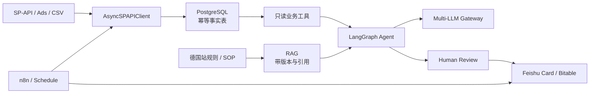

# Amazon AI Platform

> 想逐个模块学习源码，请使用：[Amazon AI Platform 逐代码学习手册](CODE_LEARNING_GUIDE.md)。<br>
> Docker 完全零基础读者请阅读：[Docker 与 Docker Compose 零基础学习手册](DOCKER_BEGINNER_GUIDE.md)。

面向 Amazon 德国站的生产级 AI Agent 作品集。项目把简历中的真实经历——服装/宠物类目运营、月 GMV 3 万美元、Python 报表、飞书自动化、C++ 高并发后端——收敛为三条可以现场演示的业务链路，而不是一组互不相连的教程脚本。

> 当前版本已完成 12 周计划中可离线验证的编程交付；Amazon/Ads/飞书真实账号联调、演示视频、真实 before/after、Release tag 仍需由账号持有人执行。README 不把离线 mock 证据写成生产上线。

## 面试官可以看到什么

1. **销售与流量数据链路**：LWA token 自动刷新 → 分操作令牌桶 → 429/5xx 全抖动重试 → 异步报表轮询 → GZIP 解压 → Pydantic 校验。
2. **Listing 决策链路**：带来源的竞品数据 → LangGraph 三节点 → 并发生成三版德语五点描述 → 确定性规则检查 → 人工审核草稿。
3. **协作链路**：订单幂等同步 Bitable → 销售/库存卡片 → `/选品` 指令 → AI 分析 → trace ID 留痕。
4. **模型基础设施**：OpenAI 兼容的 `/v1/chat/completions` → Claude / DeepSeek / OpenAI 降级链 → 熔断与并发上限 → 服务端注册的 Pydantic Schema 校验。

系统**不会**自动发布 Listing、改价、暂停广告或下采购单。这些动作必须走人工审批。

## 架构



共享数据契约位于 `amazon_ai_platform/models.py`，避免 SP-API、Agent、飞书和网关各自维护不一致的 JSON。

## 快速运行

要求 Python 3.11+，CI 使用 Python 3.12。

```bash
cd ecommerce-agent-learning-plan
python3 -m venv .venv
source .venv/bin/activate
pip install -r requirements-dev.txt

# 全部离线，不需要 Amazon、飞书或 LLM Key
python -m examples.01_spapi_client
python -m examples.02_feishu_bot
python -m examples.04_listing_agent
python -m examples.05_amazon_ads_client --demo
python -m examples.06_rag_knowledge_base --demo
pytest
ruff check amazon_ai_platform tests examples
```

启动网关：

```bash
cp .env.example .env       # Key 可先留空
uvicorn amazon_ai_platform.llm_gateway:app --port 8000
curl http://127.0.0.1:8000/health
```

填入至少一个模型 Key 后调用结构化输出：

```bash
curl -X POST http://127.0.0.1:8000/v1/chat/completions \
  -H 'content-type: application/json' \
  -H 'x-request-id: interview-demo-001' \
  -d '{
    "model":"listing-quality",
    "messages":[{"role":"user","content":"为德国站宠物地毯生成一个德语 Listing 方案"}],
    "response_format":{"type":"json_schema","name":"listing_variant"}
  }'
```

`listing_variant` 从 Prompt `2.0.0` 起采用 2026-07-27 后的双字段标题契约：

```json
{
  "title": "Hundeteppich – Waschbare Schmutzfangmatte",
  "item_highlight": "Mikrofaser für Hundehaushalte; waschbar und pflegeleicht",
  "bullets": [
    "WASCHBAR – Sachliche Produkteigenschaft mit prüfbarer Information.",
    "SAUGFÄHIG – Sachliche Produkteigenschaft mit prüfbarer Information.",
    "RUTSCHHEMMEND – Sachliche Produkteigenschaft mit prüfbarer Information.",
    "WEICH – Sachliche Produkteigenschaft mit prüfbarer Information.",
    "PFLEGELEICHT – Sachliche Produkteigenschaft mit prüfbarer Information."
  ],
  "backend_keywords": ["hundeteppich"],
  "rationale": "生成理由与事实来源说明"
}
```

非媒体类目的 `title` 含空格最多 75 个字符，`item_highlight` 最多 125 个字符。
Gateway 会拒绝旧的单标题结构或超限内容并尝试 fallback；Listing Agent 只生成草稿，
不会自动写回 Seller Central。

一键启动网关和 PostgreSQL：

```bash
docker compose up --build -d
docker compose ps
curl http://127.0.0.1:8000/health
```

## 代码地图

| 模块 | 核心文件 | 已实现的工程细节 |
|---|---|---|
| Data Contracts | `amazon_ai_platform/models.py`、`data_quality.py` | Sales/Order/Ads 原始层、标准层、指标层，20 条质量规则、幂等导入、0.5% reconciliation |
| Data Engine | `amazon_ai_platform/spapi.py`、`pipeline.py` | `AsyncSPAPIClient`、窗口缓存、事务 raw/upsert/cursor、回滚、request ID/文件哈希 trace |
| Ads Engine | `amazon_ai_platform/ads.py` | Reporting v3 create/poll/GZIP、ACOS/CTR/CVR/CPC/TACOS、低样本与 14 天归因保护、只生成待审建议 |
| Business Hub | `amazon_ai_platform/feishu.py` | token 缓存、卡片纯函数、Bitable search + update/create 幂等写、订单同步、事件验签 token、选品指令 |
| Brain Gateway | `amazon_ai_platform/llm_gateway.py` | 标准接口、多 Provider Adapter、fallback、circuit breaker、并发闸门、注册 Schema + Pydantic 二次校验 |
| Prompt/RAG | `amazon_ai_platform/prompts.py`、`rag.py` | Prompt 版本/Schema、40 条跨类目评测、版本/生效时间/权限检索、50 条检索与拒答评测、引用 |
| Decision Engine | `amazon_ai_platform/listing_agent.py` | 三节点图、三版五点、75 字符 Title + 125 字符 Item Highlight、事实来源、重试、checkpoint、德国站规则与人审记录 |
| MCP | `amazon_ai_platform/mcp_server.py` | 官方 SDK 四个最小工具；seller/marketplace 由认证上下文注入，无发布/改价/广告写工具 |
| Runtime | `business_api.py`、`worker.py`、`telemetry.py` | 飞书 webhook、Redis worker SIGTERM draining、OpenTelemetry trace、Prometheus 格式网关指标 |
| Persistence | `sql/init.sql`、`alembic/` | raw、标准指标、Ads、游标、告警、审计、人审表及 Alembic migration |
| Tests | `tests/` | 全离线确定性测试；429、超时、FATAL、事务回滚、非法 JSON、权限、过期规则与 HITL |

示例文件只是薄入口，核心逻辑位于生产包，可被 API、worker、MCP 和测试共同复用。

## 离线验收证据

```bash
source .venv/bin/activate
pytest
ruff check amazon_ai_platform tests examples
python -m examples.01_spapi_client
python -m examples.04_listing_agent
python -m examples.05_amazon_ads_client --demo
python -m examples.06_rag_knowledge_base --demo
alembic upgrade head --sql > /tmp/amazon-ai-migration.sql
docker compose config --quiet
```

固定评测资产位于 `tests/fixtures/`：Listing 40 条（西服 20、宠物 20），RAG 50 条（拒答 15）。低代码 workflow 位于 `workflows/`，只做调度、webhook、错误升级与人工等待。

真实账号验收必须另行记录：SP-API/Ads sandbox request ID、飞书测试表记录、权限 smoke test、视频、真实聚合 before/after 和 Release tag。没有这些证据时只能表述为“离线实现并通过 mock 验收”。

Docker 四服务运行验收已于 2026-07-16 在本地 Colima 完成，包括 health、非 root、数据库初始化/回滚、Redis 队列消费、安全 503 和 SIGTERM draining；详见 `docs/docker-acceptance-2026-07-16.md`。验收后已执行普通 `docker compose down`，保留命名卷。

## 设计选择

- **当前 SP-API 请求默认不要求 AWS Key/SigV4。** 当前 Amazon 上手文档的常规调用凭据是 LWA client/secret、refresh token 与区域 endpoint；客户端仍允许注入 `signer`，用于兼容仍需签名的旧基础设施，但不把历史方案设为默认。
- **限流按操作隔离。** Amazon 的 usage plan 是 operation 维度且可能动态变化；不同 API 共用一个桶会导致低频 Reports 拖垮 Orders。
- **模型输出要验证两次。** Provider 收到 JSON Schema 只是请求，Gateway 仍用 Pydantic 解析；无效 JSON 与超时一样触发下一 Provider。
- **规则检查不用 LLM 自证。** 2026-07-27 起非媒体类目的 Title 75 字符、Item Highlight 125 字符限制，以及绝对化用语、五点数量等由确定性代码检查；法律适用性和类目规则交给人工与版本化知识库。
- **幂等先于自动化。** 订单以 `AmazonOrderId`、告警以 `source_key` upsert；重跑不会制造重复业务事件。
- **PII 不进入模型。** 当前模型只含订单业务字段，不含姓名、地址、邮箱。需要 PII 的 SP-API 操作必须单独实现 Restricted Data Token 和更严格审计。

## 真实账号联调顺序

1. 先用 Amazon dynamic/static sandbox 验证请求形状。
2. 私有应用自授权，只申请完成演示所需的最小角色；Sales & Traffic 报表需要 Brand Analytics。
3. 首次只拉 7 天并保存 `request_id`、时间范围和原始文件哈希；同一时间范围命中本地缓存。
4. 飞书先用测试群和测试 Bitable；用固定 `source_key` 连续执行两次，证明第二次为更新而非新增。
5. 网关先只开一个低成本模型，再人为让主 Provider 返回 503，展示 fallback_count 和熔断行为。
6. Listing 输出只进入“待审核”表；面试现场由人选择版本，不调用 Amazon 写接口。

## GitHub 展示清单

- `README` 首屏给出业务结果、架构、三条 demo 命令。
- CI 必须通过：`ruff + pytest + offline listing demo`。
- 提交一张脱敏飞书卡片截图、一段 2–3 分钟演示视频和一份 `docs/demo-script.md`。
- 增加 `docs/adr/`：为什么不用一个大 Prompt、为什么不用 LLM 做硬规则、为什么不直接自动执行。
- 测试数据必须标注 `synthetic`；真实销售数字只能写汇总，不上传订单、token、买家信息。
- Release v1.0 的 tag 只在 12 周验收全部通过后创建。

## 参考依据

- [Amazon SP-API onboarding](https://developer-docs.amazon.com/sp-api/docs/onboarding-overview)
- [Amazon Usage Plans and Rate Limits](https://developer-docs.amazon.com/sp-api/docs/usage-plans-and-rate-limits)
- [Sales and Traffic Business Report](https://developer-docs.amazon.com/sp-api/docs/report-type-values-analytics)
- [Reports API request tutorial](https://developer-docs.amazon.com/sp-api/docs/reports-api-v2021-06-30-tutorial-request-a-report)
- [Amazon：2026-07-27 产品标题与 Item Highlights 更新公告](https://sellercentral.amazon.com/seller-forums/discussions/t/145b6d0f-999c-4555-896c-c694bda2e470)
- [Feishu server API calling process](https://open.feishu.cn/document/server-docs/api-call-guide/calling-process/get-)
- [EU Regulation 2023/988 (GPSR)](https://eur-lex.europa.eu/legal-content/EN/TXT/?uri=CELEX%3A32023R0988)

完整周计划、避坑矩阵、验收条件与面试 Point 见 [LEARNING_PLAN.md](LEARNING_PLAN.md)。
