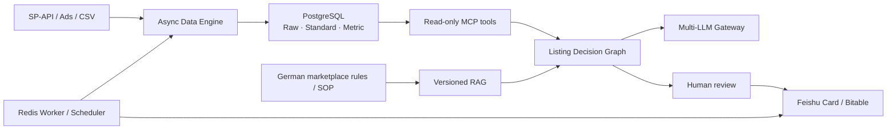

# Amazon AI Platform

面向 Amazon 德国站运营场景的个人实战项目：将销售与广告数据、合规知识、LLM 决策和人工审核组织成一套可离线验证的 AI Agent 平台骨架。

它解决的不是“让模型自动运营店铺”，而是把报表处理、Listing 优化和异常解释中重复、易错且难追溯的工作，转化为带数据契约、失败策略、审计线索和人工决策边界的工程流程。

> 当前状态：核心能力已通过本地离线测试与 Docker Compose 验收。Amazon SP-API、Ads、飞书和 LLM Provider 的真实账号联调不属于本仓库的已验证结论。

## 核心场景

| 场景 | 项目能力 | 安全边界 |
|---|---|---|
| 销售与流量数据 | 异步拉取、报表轮询、数据标准化、质量检查、幂等写入和 reconciliation | synthetic 数据可离线复现；真实订单与 Buyer PII 不进入仓库或模型 |
| 德国站 Listing 草稿 | 可信事实输入、三版德语草稿、确定性合规检查、RAG 引用 | 仅生成草稿；发布、改价和库存操作必须由人完成 |
| 广告异常解释 | 归因窗口保护、指标计算、证据优先的待审建议 | 不自动调整预算、竞价或广告状态 |
| 团队协作与运行 | 飞书 Bitable 幂等同步、Webhook、Redis worker、Gateway fallback 与 telemetry | 所有外部写操作使用稳定业务键；密钥和 PII 脱敏 |

## 架构



共享的 Pydantic 数据契约位于 `amazon_ai_platform/models.py`。Provider adapter、业务逻辑与人审动作分层，避免将第三方协议、模型输出和高风险写操作混在一起。

## 快速开始

要求 Python 3.11+；CI 与容器使用 Python 3.12。

```bash
git clone https://github.com/binn-997/ecommerce-agent-learning.git
cd ecommerce-agent-learning
python3 -m venv .venv
source .venv/bin/activate
pip install -r requirements-dev.txt

# 全部为离线 synthetic 演示，无需 Amazon、飞书或 LLM Key
pytest
ruff check amazon_ai_platform tests examples
python -m examples.01_spapi_client
python -m examples.04_listing_agent
python -m examples.05_amazon_ads_client --demo
python -m examples.06_rag_knowledge_base --demo
```

启动本地 Gateway：

```bash
cp .env.example .env
uvicorn amazon_ai_platform.llm_gateway:app --port 8000
curl http://127.0.0.1:8000/health
```

使用 Docker Compose 启动 Gateway、Worker、PostgreSQL 和 Redis：

```bash
docker compose config --quiet
docker compose up --build -d
docker compose ps
curl http://127.0.0.1:8000/health
docker compose down
```

`docker compose down` 默认保留命名卷；不要在含有本地数据的环境中随意附加 `-v`。

## 可演示的工程能力

- **Async SP-API Data Engine**：LWA Token 并发刷新保护、按 operation 的令牌桶限流、429/可恢复 5xx 抖动重试、异步报表创建/轮询/下载/GZIP 解析，以及 Pydantic 外部数据校验。
- **可靠数据管道**：Raw → Standard → Metric 分层；事务、稳定幂等键、游标和 reconciliation，支持失败回滚与证据回溯。
- **Multi-LLM Gateway**：OpenAI 兼容接口，OpenAI / Anthropic / DeepSeek adapter 边界，超时、并发闸门、熔断、fallback，以及 JSON Schema 与 Pydantic 双重结构化验证。
- **Listing Decision Engine**：LangGraph 三阶段流程，生成三个候选版本与五条卖点；非媒体类目遵守 `title` 最多 75 字符、`item_highlight` 最多 125 字符的规则；输出固定为 `requires_human_review=true`。
- **RAG 与 Prompt 资产化**：规则按版本、生效时间、类目、站点、语言和权限过滤；检索结果带引用，缺少可信证据时拒答。
- **协作、运行与安全**：飞书卡片和 Bitable upsert、Redis worker SIGTERM draining、OpenTelemetry/Prometheus 指标、MCP 最小只读工具面、PII 脱敏与拒绝高风险自动执行。

## 项目结构

```text
amazon_ai_platform/       可复用业务逻辑与外部 Provider adapter
tests/                    离线、确定性的 pytest 回归测试
examples/                 薄的演示入口，不复制业务实现
sql/ + alembic/           PostgreSQL 初始化与迁移
workflows/                调度、Webhook、等待人审的低代码 workflow
docs/                     架构、ADR、威胁模型、容量和验收资料
Dockerfile                Gateway 镜像定义
docker-compose.yml        Gateway + Worker + PostgreSQL + Redis
```

详细模块职责、数据流和本地验收路径见 [项目结构说明](docs/PROJECT_OVERVIEW.md)。

## 质量与安全边界

- 测试不调用 Amazon、飞书、LLM 或 Redis 真正的线上服务；外部协议边界均以 mock 或 synthetic fixture 覆盖。
- 对 429、超时、5xx、非法 JSON、重复事件、事务回滚、RAG 越权/过期规则、合规命中和人工审核边界都有确定性测试。
- 不提交 `.env`、Token、真实订单、Buyer PII 或生产数据库文件。
- Listing 发布、价格变更、广告预算与采购单创建均不在自动化能力范围内。

## 项目文档

| 文档 | 说明 |
|---|---|
| [项目结构说明](docs/PROJECT_OVERVIEW.md) | 模块边界、数据流、运行方式与验收入口 |
| [演示脚本](docs/demo-script.md) | 2–3 分钟现场演示流程与脱敏要求 |
| [威胁模型](docs/threat-model.md) | 资产、信任边界、风险控制与验证位置 |
| [容量与成本估算](docs/capacity-and-cost.md) | 单 seller 到 100 sellers 的规划假设 |
| [架构决策记录](docs/adr/) | 显式决策图、确定性合规与 Provider 边界 |
| [Docker 验收记录](docs/docker-acceptance-2026-07-16.md) | 本地 Compose 运行证据及环境范围 |
| [外部验收模板](docs/acceptance-evidence-template.md) | 真实账号联调时应补充的证据格式 |

## 验收范围

本项目可以在本地完成静态检查、pytest、离线示例、迁移 SQL 生成与 Docker Compose 健康检查。真实业务环境仍需由账号持有人按最小权限完成 sandbox/测试租户验证，并记录脱敏 request ID、审计记录和实际运行证据；没有这些证据时，不应声称系统已在生产环境上线。

## 参考依据

- [Amazon SP-API onboarding](https://developer-docs.amazon.com/sp-api/docs/onboarding-overview)
- [Amazon Usage Plans and Rate Limits](https://developer-docs.amazon.com/sp-api/docs/usage-plans-and-rate-limits)
- [Sales and Traffic Business Report](https://developer-docs.amazon.com/sp-api/docs/report-type-values-analytics)
- [Amazon 产品标题与 Item Highlights 更新公告](https://sellercentral.amazon.com/seller-forums/discussions/t/145b6d0f-999c-4555-896c-c694bda2e470)
- [Feishu server API calling process](https://open.feishu.cn/document/server-docs/api-call-guide/calling-process/get-)
