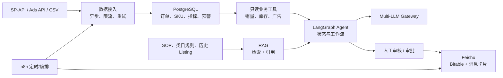

# Amazon AI Platform：从运营开发者到电商 Agent 工程师

这是一个**以代码为主线**的学习项目，而不是工具清单。它把“亚马逊运营里的问题”拆成可测试的软件模块：数据从哪里来、如何可靠同步、模型能依据什么回答、什么动作必须由人确认。学习目标是完成一个真实可演示的 Amazon AI Platform，而不是在简历里罗列 LangGraph、RAG、MCP 等名词。

本目录假定你已有基本编程能力和 Amazon DE 运营经验；不假定你已经学过 Python Web、SP-API、飞书 API、LLM、RAG、LangGraph 或 Docker。

## 目录与运行方式

```text
ecommerce-agent-learning-plan/
├── README.md                         # 本手册
├── .env.example                      # 本地凭据模板，绝不提交真实 .env
├── requirements.txt
├── docker-compose.yml                # 本地 PostgreSQL
├── sql/init.sql                      # 订单、指标、预警表及去重约束
└── examples/
    ├── 01_spapi_client.py            # SP-API：LWA、SigV4、限流、订单分页
    ├── 02_feishu_bot.py              # 飞书：卡片消息与 Bitable 写入
    ├── 03_llm_gateway.py             # FastAPI + LiteLLM 统一模型网关
    ├── 04_listing_agent.py           # LangGraph Listing 生成与合规循环
    ├── 05_amazon_ads_client.py       # Amazon Ads Reporting v3 模式
    └── 06_rag_knowledge_base.py      # RAG：切分、Embedding、检索、引用
```

```bash
cd /Users/cpt/project/aiyy/ecommerce-agent-learning-plan
python3 -m venv .venv
source .venv/bin/activate
pip install -r requirements.txt
cp .env.example .env

# 无需凭据的离线示例
python examples/01_spapi_client.py --demo
python examples/02_feishu_bot.py --demo
python examples/04_listing_agent.py --demo
python examples/05_amazon_ads_client.py --demo
python examples/06_rag_knowledge_base.py --demo

# 启动模型网关；无 API Key 时 /health 仍可验证
uvicorn examples.03_llm_gateway:app --reload --port 8000
curl http://127.0.0.1:8000/health

# 启动本地数据库
docker compose up -d postgres
```

所有 `--demo` 都使用 mock transport 或本地算法，不会碰真实账号。真实 API 调用前必须在 `.env` 中填入凭据，并先用测试群、脱敏文档、过去 24 小时的小时间窗口验证。`.env`、refresh token、客户 PII、订单导出绝不能进入 Git。

## 最终系统与边界



需要始终遵守的四条边界：

1. LLM 可以给出草稿、解释、分类和建议；不能直接修改价格、广告预算、Listing 或采购单。
2. RAG 的作用是提供可追溯的依据，不是让模型“记住公司资料”。没有检索依据时必须拒答或转人工。
3. 数据同步用幂等键、限流和重试；不能因为一次网络错误造成重复订单或静默漏数。
4. 真实生产数据、政策、广告决策必须保留来源、时间范围、request ID 与人工操作记录。

---

## 模块 1：Amazon SP-API 数据底座

### 为什么它排在最前

电商 Agent 的价值来自真实业务数据，而不是会聊天。先用订单、库存和广告数据建立可靠指标，后面的 RAG、Agent、飞书通知才有正确的输入。SP-API（卖家数据）和 Amazon Ads API（广告数据）是**两套 API 与权限流程**，不要混成一个 SDK。

### 示例：`01_spapi_client.py`

运行：

```bash
python examples/01_spapi_client.py --demo
```

代码中的小模块及作用：

| 模块 | 做什么 | 必须理解的点 |
|---|---|---|
| `TokenBucket` | 用异步令牌桶控制请求速度 | `rate_per_second` 是稳定补充速度，`capacity` 是突发上限；每个 API 操作的限流额度不同，不能照抄 Orders 数值到所有端点。 |
| `SPAPIClient.__init__` | 接收 LWA、AWS、区域、Marketplace 配置 | LWA token 用于卖家授权，AWS 凭据用于 SigV4 签名；两者缺一不可。 |
| `_lwa_access_token()` | 使用 refresh token 兑换并缓存 access token | 过期前 60 秒主动刷新，避免并发请求恰好拿到过期 token。生产环境还应有分布式锁/共享缓存。 |
| `request()` | 限流、构造 URL、添加 `x-amz-access-token`、SigV4 签名、重试可恢复错误 | 只重试 429 与临时 5xx；4xx 参数/权限错误应立即暴露，不能盲目重试。 |
| `get_orders()` | 按 `CreatedAfter` 拉订单并处理 `NextToken` | 分页后的请求只带 `NextToken`；导入数据库时用 `AmazonOrderId` 做幂等键。 |
| `demo()` | 用 `httpx.MockTransport` 模拟 LWA 与 SP-API | mock 让认证、分页与失败场景能在没有卖家账号时测试。 |

真实调用要填写 `LWA_CLIENT_ID`、`LWA_CLIENT_SECRET`、`LWA_REFRESH_TOKEN`、AWS Key、区域、Marketplace ID。第一步只拉过去 24 小时，并把原始响应保存到 `raw_payload`，便于排查指标差异。

**下一步练习：** 为 `get_orders()` 写分页 mock；增加 `get_reports()`；把订单导入 `orders` 表时使用 `INSERT ... ON CONFLICT (amazon_order_id) DO UPDATE`。不要在未验证权限时先写一整套 SP-API “平台”。

### 示例：`05_amazon_ads_client.py`

运行：

```bash
python examples/05_amazon_ads_client.py --demo
```

| 模块 | 做什么 | 业务含义 |
|---|---|---|
| `_headers()` | 获取 Ads LWA token，并加入 client ID 与 profile ID | 广告账户由 profile ID 区分；不要错用 SP-API marketplace ID。 |
| `create_campaign_report()` | 创建 Sponsored Products campaign 报告 | Ads 报告是异步任务：创建成功不代表报表已可下载。 |
| `get_report_status()` | 轮询报告状态 | 仅在 `SUCCESS` 后下载；失败要写审计日志并通知人工。 |

完成后计算的核心指标应明确口径：`ACOS = spend / attributed_sales`，`CTR = clicks / impressions`，`CVR = purchases / clicks`。应同时展示日期、归因窗口、广告类型；没有这些上下文的“ACOS 异常”不可用于决策。

资料：[SP-API 官方文档](https://developer-docs.amazon.com/sp-api/)、[Amazon Ads API](https://advertising.amazon.com/API/docs)。

---

## 模块 2：数据库、运营指标与 Feishu 协作闭环

### `sql/init.sql`：为什么需要四张表

| 表 | 保存什么 | 关键设计 |
|---|---|---|
| `sku_master` | SKU 的静态主数据与补货阈值 | SKU 是其它业务表的外键，避免把商品名复制到每张报表。 |
| `orders` | 原始订单及标准化金额/状态 | `amazon_order_id` 是主键，保证同步可重复执行。 |
| `daily_metrics` | 每 SKU 每日销量、营收、广告花费、库存 | `(metric_date, sku)` 联合主键，支持重跑同一日指标。 |
| `alerts` | 每次需要人工处理的异常 | `source_key` 主键，用于通知去重。 |

`docker-compose.yml` 只启动 PostgreSQL 并挂载 `sql/init.sql`。这是故意的：先让数据库稳定，再将 Gateway、任务调度、Agent 拆为容器。请把数据库密码替换为本地私密值；生产环境使用 secret manager 而不是写在 compose 中。

### 示例：`02_feishu_bot.py`

运行：

```bash
python examples/02_feishu_bot.py --demo
```

| 模块 | 做什么 | 需要关注 |
|---|---|---|
| `SalesAlert` | 用 dataclass 定义一条预警所需的业务字段 | 把业务输入收敛在 schema 中，而不是在 JSON 字符串里到处取值。 |
| `FeishuBot._headers()` | 兑换 tenant access token，生成鉴权头 | 应用权限、Bitable 权限、机器人入群缺任何一个都会失败。 |
| `card()` | 纯函数：预警对象 → 飞书卡片 JSON | 纯函数容易 snapshot 测试；低库存显示红色只是提醒，不代表自动补货。 |
| `send_sales_report_card()` | 向指定群发送 interactive 消息 | `chat_id` 是群 ID，不是用户 ID；消息内容要 `json.dumps`。 |
| `create_bitable_alert()` | 将同一事件留痕到 Bitable | 真实版应先按 `source_key` 查询；若已存在则更新，而非重复创建。 |

建议先在飞书手工创建三张关联表：SKU 主数据、每日指标、预警记录。再用 API 写记录。第一张卡片只发到测试群；卡片按钮只做“确认收到/创建审批草稿”，不要直接调用改价、暂停广告或创建采购单。

资料：[飞书开放平台](https://open.feishu.cn/document/)、[卡片概览](https://open.feishu.cn/document/feishu-cards/cardkit-overview)。

---

## 模块 3：Multi-LLM Gateway——把供应商从业务代码中隔离

### 示例：`03_llm_gateway.py`

启动和测试：

```bash
uvicorn examples.03_llm_gateway:app --reload --port 8000

curl -X POST http://127.0.0.1:8000/chat \
  -H 'content-type: application/json' \
  -d '{"model":"openai/gpt-4.1-mini","messages":[{"role":"user","content":"为宠物地毯生成一个标题"}]}'
```

| 模块 | 做什么 | 工程意义 |
|---|---|---|
| `Message` | 约束角色与最大内容长度 | 拒绝无效角色和异常大的输入，降低意外成本。 |
| `ChatRequest` | 统一模型、消息、温度和可选 JSON Schema | 业务代码不需要知道供应商 SDK 的参数差异。 |
| `ChatResponse` | 返回请求 ID、模型、内容、耗时 | 线上排障至少能关联一条用户请求。 |
| `/health` | 不调用外部模型的健康检查 | 容器编排可以判断服务是否活着。 |
| `/chat` | 调 LiteLLM 的异步 `acompletion` | 连接超时或模型异常统一转成 503，避免把内部堆栈暴露给调用方。 |

`json_schema` 是 Structured Output 的入口。例如 Listing 标题必须符合长度/字段格式时，先设计 schema，再要求模型返回 JSON；收到后还需要用 Pydantic 二次解析。当前示例展示网关基础形态，尚未持久化成本与 prompt 版本；学习时应自行加中间件记录模型、token、延迟、状态码，但不得记录订单地址或完整客户聊天内容。

资料：[FastAPI](https://fastapi.tiangolo.com/)、[Pydantic](https://docs.pydantic.dev/)、[LiteLLM](https://docs.litellm.ai/)。

---

## 模块 4：RAG 知识库——让答案有依据，而不是让模型猜

### RAG 在电商系统中解决什么

RAG 用于把会变化、需要引用的内容提供给模型：退货 SOP、类目禁词、品牌规范、产品手册、客服知识、历史审核案例。它**不**适合替代订单/库存的实时查询，后者必须由受权限控制的数据库或 SP-API 工具完成。

一个合格的 RAG 请求是：

```text
文档 → 清洗/权限标记 → Chunk → Embedding → 向量库
问题 → Embedding → 检索/重排 → 有引用的上下文 → LLM 回答或拒答
```

### 示例：`06_rag_knowledge_base.py`

运行：

```bash
# 离线：Hash embedding，验证完整管道但不代表真实语义质量
python examples/06_rag_knowledge_base.py --demo

# 真实：需要与 LiteLLM 兼容的 embedding 模型 API Key
python examples/06_rag_knowledge_base.py --model openai/text-embedding-3-small
```

| 模块 | 做什么 | 为什么存在 |
|---|---|---|
| `Document` | 原始文档 ID、标题、正文 | 原文 ID 是权限、版本和审计的基础。 |
| `Chunk` | 可检索的小片段，带回文档 ID/标题 | 生成答案时必须能回溯“这句话来自哪份 SOP”。 |
| `chunk_document()` | 按段落累计切分，超长时保留 overlap | 太大检索不准，太小丢上下文；需在评测集上调参。 |
| `HashEmbedder` | 本地确定性向量 | 只用于离线理解、单测和 CI；不能用于评价 RAG 的语义效果。 |
| `LiteLLMEmbedder` | 调用真实 embedding API | 用相同接口替换 demo，不改变上层索引代码。 |
| `InMemoryRAG.add_documents()` | 文档切分并保存 chunk/vector | 内存索引便于学习；生产替换为 pgvector/Qdrant。 |
| `search()` | query 向量与 chunk 向量做余弦相似度排序 | `min_score` 是“证据不足则拒答”的第一道阈值。 |
| `answer_context()` | 返回含 chunk ID、标题、分数的上下文 | LLM 最终回答必须继续引用这些标识，不能隐藏来源。 |

示例内置三份 SOP，并问“标题能否写 Guaranteed Best”。它会检索 Listing 规则并输出 chunk 引用。然后把该上下文连同系统提示交给 Gateway：**只可依据上下文回答；没有依据时返回 `insufficient_evidence`；输出引用 chunk ID。**

### RAG 的练习顺序

1. 用 10 份脱敏 SOP/规则文档运行示例，检查切分结果是否把一个规则拆断。
2. 人工写 30 个问题及正确文档 ID，其中至少 10 个应拒答的问题。
3. 对每个问题记录 `top_k` 是否包含正确 chunk（检索召回率），再评估最终回答是否忠于资料（groundedness）。不要只看回答“像不像对”。
4. 将内存向量替换为 pgvector 或 Qdrant；元数据至少包含 `document_id`、版本、语言、类目、权限范围、更新时间。
5. 增加权限过滤，确保德国站 SOP、品牌资料、客服对话不能被无关用户检索到。

### 常见失败与调试

| 现象 | 常见原因 | 处理方式 |
|---|---|---|
| 检索到完全无关内容 | 文档过短、模型不合适、问题没有关键词 | 看 top-k chunk 和分数，不要只改 prompt。 |
| 找到正确片段但答案乱编 | 没有“仅依赖上下文”约束或没有引用校验 | 强制 JSON 输出 `answer/citations/insufficient_evidence`。 |
| 同一规则相互矛盾 | 文档版本混入 | metadata 加版本与生效日期，只检索最新有效版本。 |
| 客服问订单状态却得到 SOP | 把实时数据当知识文档 | 订单状态应走只读工具调用，RAG 只解释政策。 |

资料：[RAG 概念与实现参考](https://docs.langchain.com/oss/python/langchain/rag)、[pgvector](https://github.com/pgvector/pgvector)。

---

## 模块 5：LangGraph Listing Optimization Agent

### 示例：`04_listing_agent.py`

运行：

```bash
python examples/04_listing_agent.py --demo
```

图中的数据流是：`analyse_competitor → generate_title → safety_check → (通过结束 | 自动修复 | 人工审核)`。

| 模块 | 做什么 | 学习重点 |
|---|---|---|
| `ListingState` | 定义图中流动的状态 | 状态包括输入、标题、违规、次数、审计日志；不要靠全局变量传业务信息。 |
| `MockListingLLM` | 离线可预测的“模型” | 首次故意生成违规词，第二次修复；用它测试循环而不花模型费用。 |
| `analyse_competitor()` | 生成竞争信息摘要 | 以后从合规抓取/授权数据源或 RAG 获取，不能让模型凭空声称竞品事实。 |
| `generate_title()` | 基于状态生成标题 | 生产版改为调用 Gateway，并要求结构化输出。 |
| `safety_check()` | 用确定性规则检查禁词、长度、主关键词 | 高风险规则优先代码检查，LLM 只做语义辅助。 |
| `next_step()` | 决定终止、重试还是人工审核 | 重试次数有上限，避免 Agent 无限循环。 |
| `auto_fix()` / `human_review()` | 写审计记录并进入下一步 | 人工审核是系统节点，不是报错分支。 |
| `StateGraph` | 显式注册节点与边 | 可画图、可单测、可追踪，比“一个超长 prompt”可靠。 |

将 RAG 接入的位置是 `analyse_competitor` 前：先检索类目规范、品牌语气、历史合格 Listing，再把带引用的片段加入生成上下文。规则检查仍应独立运行，不能相信“模型说自己合规”。

资料：[LangGraph](https://docs.langchain.com/oss/python/langgraph/overview)。

---

## 模块 6：生产化、测试与可展示项目

### 最小测试集

每个模块都应至少有三类测试：

- 成功路径：订单分页、卡片 JSON、RAG 找到正确 SOP、违规标题被修复。
- 失败路径：LWA 401、SP-API 429、飞书权限不足、Embedding 超时、检索无依据。
- 业务边界：重复 `source_key` 不重复告警；没有订单权限的用户不能查询订单；RAG 不能用过期政策回答。

### 从示例到项目的替换顺序

| 现在的学习实现 | 项目化时替换为 |
|---|---|
| `httpx.MockTransport` | pytest mock、沙箱或最小真实账户调用 |
| 内存 RAG | pgvector/Qdrant + 文档版本/权限元数据 |
| `MockListingLLM` | 对 Phase 3 Gateway 的异步 HTTP 客户端 |
| 直接 `print` | 结构化日志、request ID、指标和告警 |
| 单个脚本 | `app/clients`、`app/services`、`app/api`、`tests` 分层 |
| 手动运行 | n8n/cron 触发、错误工作流与人工升级 |

最终只需完整展示三条链路：

1. **库存预警**：SP-API/CSV → 指标 → PostgreSQL → Feishu 卡片 → 人工审批。
2. **Listing 质检**：规格 + RAG 规则 → LangGraph → 结构化草稿/违规报告 → 人工审核。
3. **广告异常解释**：Ads 报表 → ACOS/CTR/CVR → 带时间范围的数据解释 → Bitable 留痕。

每条链路 README 都要写清：数据来源是真实、沙箱还是模拟；输入输出；权限；失败时发生什么；人工能在哪里接管；量化指标如何计算。完成前不要声称“已开发 SP-API、RAG、MCP 或 LangGraph 系统”；完成后也只描述可以现场演示的事实。
