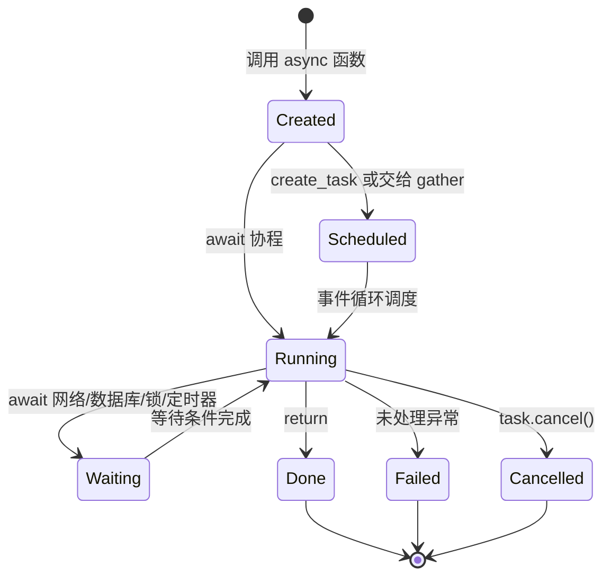

# Python 项目学习笔记

## 1. Python 环境

```bash
cd /Users/cpt/project/aiyy/ecommerce-agent-learning-plan
python3 -m venv .venv
source .venv/bin/activate
python -m pip install -r requirements-dev.txt
```

- `python3 -m venv .venv`：使用 `python3` 创建名为 `.venv` 的项目虚拟环境。
- `source .venv/bin/activate`：激活虚拟环境，让当前终端优先使用项目自己的 Python、`pip` 和工具。
- `python -m pip install -r requirements-dev.txt`：用当前 Python 调用 `pip`，安装开发和测试依赖。
- `python` 不能使用而 `python3` 可以，通常是系统只安装了 Python 3，或没有创建名为 `python` 的命令别名。进入虚拟环境后，项目中的 `python` 一般可直接使用。

`.venv` 会占用本地磁盘空间，但通常已加入 `.gitignore`，不会提交到 Git，也不会让仓库本身变得臃肿。其他人可以根据依赖文件重新创建它。

## 2. 依赖文件

- `requirements.txt`：项目运行所需的依赖。
- `requirements-dev.txt`：开发、测试和代码检查所需的额外依赖，通常会通过 `-r requirements.txt` 同时安装运行依赖。

## 3. pytest 和 Ruff

`pytest` 用来验证代码功能是否正确；`ruff` 用来进行静态检查，发现代码风格、潜在错误和不符合规范的写法。Ruff 不会运行业务测试。

```bash
# 运行一个测试文件
pytest tests/test_data_quality.py -q

# 只运行指定测试函数
pytest tests/test_data_quality.py::test_advertising_denominator_zero_is_none -q

# 显示 print、日志和更完整的失败上下文
pytest tests/test_data_quality.py -q -s

# 检查指定目录中的 Python 代码
ruff check amazon_ai_platform tests examples
```

测试应当离线、稳定、可重复，因此 CI 不应依赖真实 Amazon、飞书或 LLM：网络、限流、密钥、费用、真实数据和模型随机输出都会让测试不稳定，也可能造成误操作。外部系统应使用 Mock、Fixture、Fake Provider 和合成数据；真实 API 联调应单独进行。

## 4. Python REPL

REPL 是 Python 的交互式命令行环境，含义是 Read、Eval、Print、Loop。启动：

```bash
python3
```

看到 `>>>` 后可以直接试运行表达式、查看类型和验证函数结果。输入 `exit()` 或按 `Ctrl+D` 退出。REPL 中的代码通常不会自动保存到项目文件。

## 5. Pydantic 模型校验

`StandardAdvertisingRow` 用 Pydantic 描述一行标准化广告数据，并自动检查字段类型、格式和业务规则。

字段约束示例：

- `currency: str = Field(pattern=r"^[A-Z]{3}$")`：必须是 3 位大写货币代码，例如 `USD`。
- `impressions: int = Field(ge=0)`：曝光数不能小于 0。
- `campaign_id` 和 `sku` 的长度必须在 1 到 128 之间。
- `spend` 和 `attributed_sales` 必须是非负金额，最多 2 位小数。

```python
@model_validator(mode="after")
def counts_are_consistent(self) -> "StandardAdvertisingRow":
    if self.clicks > self.impressions:
        raise ValueError("clicks cannot exceed impressions")
    if self.purchases > self.clicks:
        raise ValueError("purchases cannot exceed clicks")
    return self
```

这是模型级校验器：Pydantic 先完成字段转换和单字段校验，再执行它检查字段之间的关系。`self` 是当前模型对象；`raise ValueError` 表示数据不合法；`return self` 表示校验通过并返回模型对象。

## 6. 完成标准：追溯数据和约束

“能从任意一个输出模型向前追溯它依赖的 Standard/Raw 数据”表示：看到一个最终指标或 Agent 输出时，能说明它来自哪个数据模型、经过了哪些转换、依赖哪些原始字段以及计算逻辑。

例如：

```text
RawAdvertisingRow
    -> 清洗、转换
StandardAdvertisingRow
    -> 计算 attributed_sales / spend
AdvertisingMetrics 或最终报表输出
```

同时，至少能解释三条 Pydantic 业务约束，例如：点击数不能超过曝光数、购买数不能超过点击数、货币必须是三位大写代码。也就是说，需要理解数据血缘，以及数据为什么被认为合法。

## 7. 数据质量小实验

目标是一次只改变一个数据质量条件，观察质量门禁命中了哪条规则。相关规则位于 `amazon_ai_platform/data_quality.py` 的 `audit_sales_rows()` 中。

先运行原始测试，确认基线：

```bash
pytest tests/test_data_quality.py::test_quality_gate_reports_multiple_bad_fields -q
```

然后在测试数据中每次只改一项，再运行测试并记录 `issue.rule_id`：

| 修改 | 预期规则 |
|---|---|
| `EUR` 改为 `eur` | `DQ08_CURRENCY_FORMAT` |
| `units` 改为负数，例如 `-2` | `DQ11_UNITS_NON_NEGATIVE` |
| `parent_asin` 与 `child_asin` 改成相同的合法 ASIN | `DQ18_PARENT_CHILD_DIFFERENT` |
| 复制同一天、同 SKU 的一行 | `DQ07_IDEMPOTENT_KEY_UNIQUE` |

实验结束后必须把测试夹具恢复，否则后续正常路径测试会失败。可以用 `git diff -- tests/test_data_quality.py` 检查是否还有临时修改。

### 当前代码中的注意事项

实验说明中的“synthetic CSV”和命令与当前代码并不完全匹配：`test_quality_gate_reports_multiple_bad_fields()` 没有使用顶部的 `CSV` 常量，而是直接创建了一个坏的 `RawSalesTrafficRow`。因此，单独修改 `CSV` 后运行这个测试，测试结果不会改变。

若要观察 CSV 的变化，应让测试调用 `parse_sales_csv(CSV)` 和 `audit_sales_rows(...)`，或者在 Python REPL 中临时构造数据并打印：

```python
rows = parse_sales_csv(CSV)
issues = audit_sales_rows(
    rows,
    known_skus={"SYNTHETIC-1"},
    start=date(2026, 7, 1),
    end=date(2026, 7, 31),
    today=date(2026, 7, 31),
)
print([issue.rule_id for issue in issues])
```

## 8. 本轮学习问题速记

- `normalize_sales_rows(rows: Iterable[RawSalesTrafficRow]) -> list[StandardSalesTrafficRow]` 是带类型标注的函数定义：输入是可迭代的 Raw 行，输出是 Standard 行列表。
- 输入行的排列顺序可以变化，函数会按输入顺序处理和返回，不会自动排序；`row_number` 只是遍历时的行号，默认从 2 开始以跳过 CSV 表头。
- 字段在字典中的排列顺序通常不影响 Pydantic 按字段名校验，但输入元素必须是 `RawSalesTrafficRow`，因为代码调用了 `row.model_dump()`。
- 标准化函数会收集所有校验错误，最后统一抛出 `DataQualityError`，而不是遇到第一条错误就停止。

之后的学习问题会继续追加到本文件，使用精炼问答形式记录。

## 9. `data_quality.py` 文件结构

这个文件是一条离线数据质量流水线：

```text
CSV 文本
  -> parse_sales_csv()
RawSalesTrafficRow
  -> audit_sales_rows()
DataQualityIssue 列表
  -> normalize_sales_rows()
StandardSalesTrafficRow
  -> IdempotentMetricStore / reconcile_revenue()
存储或对账结果
```

各部分职责如下：

- 文件头导入 `csv`、`io`、`date`、`Decimal` 等标准库，用于 CSV 解析、日期校验和金额计算；`models.py` 中的 Pydantic 模型负责数据契约。
- `QUALITY_RULES` 集中列出 20 条规则，方便测试规则数量、保持规则编号稳定，也便于文档和代码对照。
- `REQUIRED_COLUMNS` 定义 CSV 必须拥有的列。缺列属于文件级错误，由 `parse_sales_csv()` 直接抛出 `DataQualityError`。
- `DataQualityError` 把多条 `DataQualityIssue` 集中放进一个异常，调用方可以一次看到所有问题，而不是修一条、重新运行一次。
- `parse_sales_csv()` 只负责把 CSV 变成 `RawSalesTrafficRow`。Raw 层保留字符串，便于审计原始值；它不负责完整的业务判断。
- `_is_asin()` 是一个私有辅助函数，集中处理 ASIN 的 10 位、大写、字母数字格式，避免主审计函数重复代码。
- `audit_sales_rows()` 是质量门禁核心。它逐行检查日期、SKU、重复键、货币、数量、金额和 ASIN，并收集全部问题后返回。`seen` 用来检测同一天同 SKU 的重复数据。
- `normalize_sales_rows()` 把 Raw 模型转换成 Standard 模型，让 Pydantic 负责字符串到日期、整数和 Decimal 的转换及标准层约束；转换失败会收集为 `SCHEMA_STANDARD_LAYER`。
- `IdempotentMetricStore` 是离线的内存 Fake Store。字典键使用 `(metric_date, sku)`，重复写入同一业务键会覆盖而不是新增，模拟数据库 upsert 的幂等行为。
- `reconcile_revenue()` 将标准化数据的收入总和与 Seller Central 总额比较，计算差额和差异比例，并根据容忍度判断是否通过。
- `_issue()`、`_parse_int()`、`_parse_decimal()` 是私有辅助函数，分别统一构造问题、解析整数和解析金额，让主流程更容易阅读。

这样分层的原因是把“原始数据保留”“质量审计”“类型标准化”“写入幂等”“金额对账”分开。每层只有一个主要职责，测试可以分别验证，也不会把外部 CSV 格式、业务规则和数据库行为混在一个大函数里。

需要注意：`audit_sales_rows()` 的 `DQ19_UNITS_WITH_REVENUE` 严重级别是 `warning`，但仍会出现在返回的问题列表中；`DataQualityError` 的错误数量描述偏通用。`reconcile_revenue()` 使用 Decimal 计算金额，避免用二进制浮点数直接累加货币。

## 10. 输入顺序是否有影响

需要区分三种顺序：

1. **CSV 列的顺序**：通常没有影响。`csv.DictReader` 按表头名称生成字典，后续通过 `row.metric_date`、`row.sku` 等字段名读取数据，所以只要表头名称正确，列可以重新排列。缺少必要表头才会触发 `DQ01_REQUIRED_COLUMNS`。
2. **质量规则的检查顺序**：没有业务影响。代码先检查日期、再检查 SKU、货币等，只是执行顺序，不要求 CSV 必须按照这个顺序提供字段。某个字段错误时，其他检查仍会继续执行。
3. **数据行的顺序**：日期可以乱序，重复行也不要求相邻。`seen` 是集合，因此只要同一天同 SKU 曾经出现过，后面再次出现就会命中 `DQ07_IDEMPOTENT_KEY_UNIQUE`。顺序只会影响哪一行被标记为重复，以及错误中的 `row_number`。

例如下面两种 CSV 列顺序都可以被正确读取：

```text
metric_date,sku,parent_asin,child_asin,currency,units,sessions,revenue
```

```text
revenue,sku,units,metric_date,currency,child_asin,sessions,parent_asin
```

但表头必须存在且拼写一致；把 `metric_date` 改名为 `date`，不会被当作同一个字段，而会触发缺少必要列的错误。

## 11. 幂等键

幂等键是用来唯一识别一条业务记录的键。对同一条记录重复执行写入操作，最终结果应该和执行一次相同，不应该产生重复数据。

本项目中的幂等键是：

```python
(metric_date, sku)
```

例如：

```text
(2026-07-01, SYNTHETIC-1)
```

`IdempotentMetricStore` 用这个键保存数据。相同文件导入两次时，第二次会覆盖相同键的记录，而不是新增第二条记录。

`audit_sales_rows()` 会在导入前检查相同日期和 SKU 是否重复，并报告 `DQ07_IDEMPOTENT_KEY_UNIQUE`。因此，“重复写入”可以安全地被覆盖，而“同一个业务键对应了不同数据”会先被质量检查发现。

## 12. 一天同一 SKU 的多笔订单

本模块处理的是按天汇总的 Sales & Traffic 数据，不是逐笔订单数据。一个 SKU 在一天内可以有很多订单，但导入前应已被汇总为一行：

```text
2026-07-01, SKU-A, units=8, revenue=399.20
```

这里的 `units=8` 代表当天多笔订单中该 SKU 的总销量。因此 `(metric_date, sku)` 作为幂等键是合理的：同一店铺、同一站点、同一天、同一 SKU 应只有一条日报汇总。

若输入是订单明细，一天同一 SKU 出现多行是正常业务，不应使用这个键。订单数据通常使用 `order_id`、`order_item_id` 等订单级键；若日报还需要区分店铺、站点、广告活动或仓库，幂等键也应扩展为包含这些维度，例如 `(marketplace_id, metric_date, sku)`。幂等键必须与数据粒度一致。

## 13. 完成标准：20 条数据质量规则与新业务键

下面每条的“业务原因”可以直接用于面试或复述。达到标准时，至少能脱离笔记解释其中 10 条。

| 规则 | 业务原因 |
|---|---|
| `DQ01_REQUIRED_COLUMNS` | 缺少列就无法知道数据含义；不能把未知字段位置猜成日期、SKU 或金额。 |
| `DQ02_DATE_FORMAT` | 无法解析的日期不能用于按天汇总、去重和趋势分析。 |
| `DQ03_DATE_WINDOW` | 只允许本次导入的业务时间范围，防止误把历史文件或错误周期的数据混入报表。 |
| `DQ04_NOT_FUTURE` | 未来日期通常表示时区、导出参数或文件内容异常，会污染当前经营指标。 |
| `DQ05_SKU_PRESENT` | 没有 SKU 就无法归属商品，也无法建立业务键。 |
| `DQ06_SKU_KNOWN` | 未知 SKU 可能是拼写错误、已下架商品或跨店铺数据，需要先人工确认归属。 |
| `DQ07_IDEMPOTENT_KEY_UNIQUE` | 同一数据粒度内重复会导致销量和收入被重复统计。 |
| `DQ08_CURRENCY_FORMAT` | 货币必须是可识别的 ISO 格式，避免把 `eur`、`EURO` 等非标准值混入金额计算。 |
| `DQ09_CURRENCY_EXPECTED` | 即使格式正确，`USD` 混入德国站 EUR 报表仍会让总收入失真。 |
| `DQ10_UNITS_INTEGER` | 销量是件数，`2.5` 或 `abc` 不能直接参与销量、转化率和库存决策。 |
| `DQ11_UNITS_NON_NEGATIVE` | 常规销售日报不应有负销量；退款应通过明确的退货/调整数据处理。 |
| `DQ12_SESSIONS_INTEGER` | 访问次数必须是整数，非整数或文本说明数据格式异常。 |
| `DQ13_SESSIONS_NON_NEGATIVE` | 访问次数不能为负；负数会产生无意义的 CVR。 |
| `DQ14_REVENUE_DECIMAL` | 金额必须能精确转换为 Decimal，不能让 `N/A` 等文本进入加总。 |
| `DQ15_REVENUE_NON_NEGATIVE` | 常规销售收入不应为负，负数往往说明退款、币种或导出逻辑需要单独处理。 |
| `DQ16_PARENT_ASIN_FORMAT` | 非法父 ASIN 无法可靠关联变体族和竞品信息。 |
| `DQ17_CHILD_ASIN_FORMAT` | 非法子 ASIN 无法定位具体可售变体，影响 Listing 和库存分析。 |
| `DQ18_PARENT_CHILD_DIFFERENT` | 父体表示变体集合，子体表示具体商品；两者相同通常说明映射错误。 |
| `DQ19_UNITS_WITH_REVENUE` | 有销量但收入为 0 值得关注，可能是促销、赠品或漏数；因此是 warning，仍可人工判断。 |
| `DQ20_PARENT_CHILD_PRESENT` | 缺少任一 ASIN 会削弱变体归因和后续 Listing 分析，需要补全。 |

### 新的稳定业务键设计

当前键 `(metric_date, sku)` 隐含前提是：只有一个店铺、一个站点、一个日报数据源。真实的多店铺、多站点系统可使用：

```python
sales_daily_key = (
    "amazon_sales_traffic_daily",
    seller_id,
    marketplace_id,
    metric_date,
    sku,
)
```

设计理由：

- `amazon_sales_traffic_daily`：区分数据来源和日报粒度，防止与订单明细、广告数据混用。
- `seller_id`：同一 SKU 可能在不同卖家账号中存在。
- `marketplace_id`：同一卖家可同时经营德国站、法国站等，站点指标不能合并为一条。
- `metric_date`：这是日报的时间粒度。
- `sku`：这是商品粒度。

不要把 `import_batch_id`、CSV 行号、导入时间放进幂等键：它们每次导入都会变化，会让同一业务记录被误判为不同记录。`currency`、`revenue`、`units` 等是这条记录的属性，不是它的身份；数值修正后应更新原记录，而不是生成新记录。

可以这样自测：如果同一份文件重跑，键必须完全相同；如果店铺、站点、日期或 SKU 任一业务维度变化，键必须不同。

## 14. `git fetch` 的作用

`git fetch` 从远程仓库下载新的提交记录、分支和标签信息到本地 Git 数据库，但不会修改当前分支、工作区文件或暂存区。

例如：

```bash
git fetch origin
```

执行后可以查看远程分支的最新状态，例如 `origin/main`，再决定是否合并。它适合在修改代码前了解远程是否已有新提交。

与 `git pull` 的区别是：`git pull` 通常等于先 `git fetch`，再把远程变更合并或变基到当前分支，因此可能改变本地文件并产生冲突；`git fetch` 只更新远程跟踪信息，本地工作文件保持不变。

### `origin`、分支与 GitHub 默认分支

`origin` 不是分支，而是远程仓库的默认别名。执行 `git clone` 时，Git 通常把克隆来源命名为 `origin`；这个名字可以改，也可以配置多个远程仓库。

```text
origin          远程仓库的别名
main            本地分支
origin/main     本地保存的“远程 main 分支状态”
```

当前仓库中，`origin` 指向 GitHub 仓库 `binn-997/ecommerce-agent-learning`，并且 `origin/HEAD -> origin/main` 表示远程默认分支是 `main`。

`master` 曾经是很多 GitHub 仓库的默认分支名；GitHub 在 2020 年后新建仓库通常默认使用 `main`。这与 `origin` 无关：`origin` 是远程名称，`main` 或 `master` 才是默认分支名称。

## 15. 用 SP-API、Ads API、Skill 和 MCP 做日报解读是否可行

可行，但它们应该各司其职：SP-API 获取销售和流量报表；Amazon Ads API 获取广告报表；MCP 把已授权、已校验的数据封装成窄的只读查询工具；Skill 或 LLM 只负责组织查询、解释结果和生成待审建议。

推荐链路：

```text
定时任务
  -> SP-API / Ads API 异步创建、轮询、下载报表
  -> Raw 数据留存、质量校验、标准化、幂等写入
  -> 销售和广告事实表
  -> MCP 只读工具
  -> Skill/LLM 生成带来源、时间窗和数据新鲜度的日报解读
  -> 人工审核建议
```

不要让每个聊天请求直接调用真实 API：报表生成是异步任务，有限流和凭据风险；同一个问题被反复询问会重复请求；模型也不应接触 refresh token。应由后台任务拉取并缓存，MCP 读取事实表。

本项目现状：

- `spapi.py` 能请求 Sales & Traffic Business Report；该报表提供按日期和 ASIN/SKU 粒度的销售、收入、流量等数据，但需要相应的 Brand Analytics 权限和账号条件。
- `ads.py` 能生成 Sponsored Products campaign 日报、轮询、下载并计算 ACOS、CTR、CVR、CPC、TACOS，还提供只生成待审建议的异常解释。
- `mcp_server.py` 当前只有 `get_sales_metrics`、库存风险、政策检索和 Listing 草稿四个工具；尚未暴露广告读取工具。

合理的新 MCP 工具可以是：

```text
get_advertising_metrics(start, end, campaign_id?)  -> ads:read
explain_advertising_anomaly(start, end, campaign_id) -> ads:read
```

它们必须由可信认证上下文注入 `seller_id` 和 `marketplace_id`，返回 `report_id`、统计时间窗、归因窗口、数据更新时间和原始指标。广告结论先由确定性代码计算，LLM 只把证据组织成人能读懂的假设，不能自动改 bid、预算或广告状态。

销售报表和广告报表合并解读时必须对齐：店铺/站点、SKU 或 ASIN 粒度、日期、币种和广告归因窗口。特别是项目当前广告数据使用 14 天归因销售，最近 14 天的 ACOS 不应被当作最终结论。

## 16. 单元 3：生产级 Async SP-API 客户端

`spapi.py` 的目标不是“把 HTTP 请求写成 async”，而是在网络等待、多人并发、Amazon 限流和异步报表生成时，仍然得到可控、可解释的结果。

### Async 的基本含义

同步代码遇到网络请求会停在原地等待；异步代码在 `await` 网络、锁、缓存或 `asyncio.sleep()` 时，把执行权交回事件循环，其他协程可以继续运行。协程是可暂停、可恢复的函数；事件循环负责在它们之间切换。

```python
response = await self.http.request(...)
```

表示“请求已经发出，等待响应时去运行别的协程”。它不等于多线程，也不会自动让 CPU 计算变快；它主要提高 I/O 等待期间的并发能力。

不要在 async 函数中使用 `time.sleep()`：它会堵住事件循环，所有协程都无法继续。应使用 `await asyncio.sleep()`。

### 四条独立机制

```text
认证：access_token() -> 双检锁 -> LWA token
限流：operation -> AsyncTokenBucket -> 等待令牌
重试：request() -> 分类错误 -> 等待后重试或抛错
报表：create -> poll -> document -> download -> 解压/校验
```

#### 认证：双检锁

`access_token()` 先在锁外检查缓存 token 是否距离过期还超过 60 秒；有效则直接返回，避免每次都抢锁。过期时才进入 `async with self._token_lock`。进入锁后再检查一次，因为等待锁的期间，另一个协程可能已经刷新成功。这样 20 个协程同时发现过期时，只有一个会发 LWA 请求，其他协程复用新 token。

即使异步通常在单线程运行，也需要锁：协程会在 `await` 处交错执行；没有锁时，多个协程可能同时读到“token 已过期”，并发刷新造成 token stampede。

#### 限流：令牌桶

`AsyncTokenBucket` 维护 `tokens`、`rate`、`capacity` 和上次更新时间。每次 `acquire()` 先按经过时间补充 token；有 token 就扣一个并继续，没有就计算还需等待多久，并在锁外 `await asyncio.sleep(delay)`。锁外等待保证其他协程仍能检查或使用桶。

`time.monotonic()` 只会向前递增，系统时间被手动调整也不会导致等待时间倒退。Reports、Orders、default 各自有桶，因为不同 API operation 的限流额度可能不同；一个慢报表不应拖住 Orders 请求。响应头 `x-amzn-RateLimit-Limit` 会更新当前桶的速率。

#### 重试：只重试临时故障

`request()` 是所有 API 调用的统一入口。每次尝试依次执行：获取限流令牌、确保 token 有效、发 HTTP 请求、读取限流响应头、决定返回/重试/抛错。

- `429`、`500/502/503/504`、网络传输错误可能是暂时问题，可重试。
- `400` 通常是参数错误，`403` 通常是权限或授权错误；等待不会修复它们，因此立即失败。
- 到达 `max_attempts` 后也必须停止，避免无限请求。

429 优先遵守 `Retry-After`；没有时采用 full jitter，即在逐次增大的等待上限内随机等待。随机化能避免很多客户端同时重试，造成第二波拥堵。异常只保留 status、operation 或 request ID 等诊断上下文，不应泄漏 token。

#### 报表：异步状态机

创建报表不是一次请求：POST 成功只返回 `reportId`，表示 Amazon 开始后台生成。`wait_for_report()` 周期性查询状态：`DONE` 时获得 `reportDocumentId`；`CANCELLED` 或 `FATAL` 明确失败；超过 deadline 抛 `TimeoutError`。等待轮询间隔时使用 `await self.sleep(poll_interval)`，因此不会阻塞其他任务。

拿到 document 后，`download_report()` 先取得下载 URL，再下载内容；若元数据标记 GZIP 就解压，最后交给 `SalesAndTrafficReport.model_validate_json()`。这一步把“不可信的外部 JSON”变成满足 Pydantic 契约的内部数据。

### 缓存与资源关闭

`get_sales_and_traffic_report()` 先用 seller、marketplace、report type、日期和 options 生成稳定缓存键。命中则不重复创建报表；这些维度缺一不可，否则可能跨店铺、跨站点或跨粒度读到错误结果。当前 `InMemoryReportCache` 只适合离线演示；多 worker 生产环境需要 Redis 或数据库的共享锁/唯一约束。

`async with AsyncSPAPIClient(...)` 会在退出时关闭由客户端自己创建的 `httpx.AsyncClient`，避免连接泄漏；若调用方传入共享 `http` 客户端，客户端不会擅自关闭它。

### 最小复述模板

“这个客户端用 async 在网络和轮询等待期间让其他协程继续运行；用双检锁防止并发 token 刷新；用按 operation 隔离的令牌桶遵守限流；只对临时错误做有限、带抖动的重试；把报表作为 create、poll、download、校验的状态机处理，并用完整窗口键缓存结果。”

## 17. LWA 请求是什么

LWA 是 `Login with Amazon` 的缩写。LWA 请求不是获取销售数据，而是向 Amazon 的认证服务请求一个短期的 `access_token`，之后 SP-API 请求使用这个 token 证明调用者已获得授权。

当前代码会向：

```text
https://api.amazon.com/auth/o2/token
```

发送类似下面的表单参数：

```text
grant_type=refresh_token
refresh_token=...
client_id=...
client_secret=...
```

几个凭据的职责不同：

- `client_id`：应用的身份标识。
- `client_secret`：应用的秘密凭据，不能写入日志或提交到 Git。
- `refresh_token`：长期授权凭据，用来换取新的短期 access token。
- `access_token`：短期访问凭据，放入后续 SP-API 请求头，例如 `x-amz-access-token`。

流程可以记成：

```text
refresh_token + client credentials
  -> LWA token endpoint
  -> access_token
  -> SP-API request header
  -> Amazon API response
```

`refresh_token` 通常不应该直接放进业务 API 请求；它只用于刷新 token。`access_token` 也会过期，所以客户端缓存它，并在距离过期 60 秒以内重新刷新。多个协程同时刷新时，`_token_lock` 保证只发送一次 LWA 刷新请求。

## 18. 单元 4：事务、回滚、Upsert 和可追溯管道

这一单元解决一个实际问题：一批数据导入过程中途失败时，不能留下半批数据，也不能让系统误以为整批已经完成。

可以把它类比成银行转账：扣款和入账必须一起成功；如果入账失败，扣款也要撤销。数据库中的“事务”就是这个原子边界。

### 一次导入做了什么

`DataPipeline.ingest_sales_metrics()` 的顺序是：

```text
BEGIN
  保存原始 payload、hash 和 trace
  逐行 upsert 标准化指标
  更新同步 cursor
COMMIT
```

代码中的关键部分是：

```python
async with self.transaction() as tx:
    await tx.store_raw(...)
    for row in rows:
        await tx.upsert_metric(row, trace_id)
    await tx.update_cursor(...)
```

`async with` 表示进入事务上下文；正常离开时提交，内部任何异常时回滚。这里的 `await` 是因为原始数据、指标和游标可能最终写入异步数据库。

如果第 50 行失败，正确结果应该是：原始 payload、前 49 行指标和 cursor 全部不存在或恢复到事务开始前的状态。否则可能出现“事实表只写了 49 行，但 cursor 已经推进到最后一天”的严重错误，下一次同步就可能跳过未写入的数据。

### 回滚如何实现

`InMemoryPipelineRepository` 是测试用的内存仓库。进入事务前，它用 `copy.deepcopy()` 保存 `raw_payloads`、`metrics` 和 `cursors` 的快照；发生异常时恢复快照，模拟 PostgreSQL 的 rollback。

`AsyncPGPipelineRepository` 则使用真实数据库的：

```python
async with self.pool.acquire() as connection:
    async with connection.transaction():
        ...
```

内存实现是测试替身，PostgreSQL 实现才是生产存储；两者需要保持相同的可观察行为。

### Upsert 是什么

Upsert = `INSERT` + `UPDATE`：不存在就插入，已存在就更新。

项目的指标使用 `(metric_date, sku)` 作为业务键：

```sql
ON CONFLICT (metric_date, sku) DO UPDATE SET
    units_sold = EXCLUDED.units_sold,
    revenue = EXCLUDED.revenue,
    sessions = EXCLUDED.sessions
```

同一份 Amazon 报表重跑时，数据库不会新增重复行，而是更新同一个业务键。这就是幂等导入。

`raw_imports` 使用 `payload_hash` 作为主键；相同原始 payload 再次导入时，只更新重放时间。`sync_cursors` 使用 `(seller_id_hash, operation)` 标识某个卖家的某种同步进度。

### 为什么需要 Protocol

`PipelineTransaction` 只规定三项能力：

```text
store_raw()
upsert_metric()
update_cursor()
```

`DataPipeline` 只依赖这个协议，不需要知道底层是内存字典、PostgreSQL、asyncpg 还是测试 Fake。这样业务编排和数据库驱动解耦，测试可以快速验证事务行为，生产环境再替换成真实数据库。

### 可追溯是什么意思

一次导入不是只保存结果，还要保留“结果从哪里来”：

```text
trace_id
  -> request_id
  -> seller_id_hash + operation
  -> date_window
  -> raw payload SHA-256
  -> 标准指标行
```

`trace_id` 用于串起一次业务运行，`request_id` 用于定位 Amazon 请求，`payload_hash` 用于确认原始输入是否相同。seller ID 使用 hash 是为了保留关联能力，同时避免把原始租户标识直接写入日志。

### 为什么不是 exactly-once

网络系统很难保证“请求只执行一次”。例如数据库已经提交成功，但客户端在收到成功响应前断网，调用方无法确定是否成功，只能重试。

更可靠的实际策略是：

```text
至少一次投递
  + 稳定幂等键
  + 数据库事务
  = 重试不会产生重复或半批结果
```

这不是承诺请求只执行一次，而是保证重复执行后的最终业务状态正确。

## 19. PostgreSQL 是异步数据库吗

严格来说，不应简单说 PostgreSQL 是“异步数据库”。PostgreSQL 是数据库服务器；异步或同步主要描述 Python 程序使用什么客户端驱动与它通信。

```text
Python 业务代码
  -> asyncpg 异步驱动
  -> PostgreSQL 数据库服务器
```

项目中的：

```python
async with self.pool.acquire() as connection:
    async with connection.transaction():
        await connection.execute(...)
```

表示 Python 在等待数据库连接、事务和 SQL 执行结果时，可以把控制权交给事件循环。`asyncpg` 是异步 PostgreSQL 驱动，所以这里需要 `async` 和 `await`。

如果使用同步驱动，写法可能是：

```python
connection = sync_driver.connect(...)
connection.execute(...)
```

这时当前线程会阻塞等待数据库返回，但数据库服务器本身仍然可以同时处理其他连接。换句话说：PostgreSQL 支持并发处理，不等于每个客户端都必须异步；异步主要是客户端应用如何等待数据库 I/O 的选择。

## 20. Async/await 写法与协程状态

### 最小例子

```python
import asyncio


async def fetch_sales() -> str:
    await asyncio.sleep(1)  # 模拟网络等待
    return "sales data"


async def main() -> None:
    result = await fetch_sales()
    print(result)


asyncio.run(main())
```

含义是：

- `async def` 定义协程函数；调用 `fetch_sales()` 时先得到协程对象，不会立即执行函数体。
- `await fetch_sales()` 才会等待它执行完成，并拿到返回值。
- `asyncio.run(main())` 创建事件循环、运行顶层协程，结束后关闭事件循环。
- `await` 只能在 `async def` 内使用。

### 顺序执行与并发等待

下面两个任务会依次等待，总耗时约为 3 秒：

```python
async def main() -> None:
    await asyncio.sleep(1)
    await asyncio.sleep(2)
```

使用 `asyncio.gather()` 可以让两个 I/O 等待同时开始，总耗时约为 2 秒：

```python
async def job(name: str, seconds: float) -> str:
    await asyncio.sleep(seconds)
    return f"{name} done"


async def main() -> None:
    results = await asyncio.gather(
        job("sales", 1),
        job("ads", 2),
    )
    print(results)
```

这里不是两个 CPU 线程同时计算，而是一个事件循环在两个任务等待时交替推进。适合网络请求、数据库查询、报表轮询，不适合直接加速大量 CPU 计算。

### `create_task()`：先启动，稍后等待

```python
async def main() -> None:
    sales_task = asyncio.create_task(job("sales", 1))
    ads_task = asyncio.create_task(job("ads", 2))

    print("两个任务已经启动")
    sales = await sales_task
    ads = await ads_task
    print(sales, ads)
```

`create_task()` 把协程安排到事件循环中执行，并返回一个 Task。Task 不能被遗忘：必须最终 `await` 它，或者明确取消并处理异常，否则可能产生未处理异常或资源泄漏。一次性等待多个任务时，通常优先使用 `gather()`。

### 异步上下文管理器

数据库连接和 HTTP 客户端常写成：

```python
async with client:
    result = await client.fetch()
```

它相当于“进入时准备资源，退出时释放资源”。项目中的 `async with self.transaction()` 就是在进入时开始事务，正常退出时提交，异常退出时回滚。

### 协程状态图



关键点是：`await` 不是“永远停住”，而是当前协程暂时进入 `Waiting`，事件循环可以运行其他任务；等待完成后，它会回到 `Running`，从 `await` 后面继续执行。

### 常见错误

```python
async def bad() -> None:
    time.sleep(2)  # 错误：阻塞事件循环
```

应改成：

```python
async def good() -> None:
    await asyncio.sleep(2)
```

还要避免只调用协程但不等待：

```python
fetch_sales()  # 只创建协程对象，函数体可能根本没有执行
```

应该写成：

```python
await fetch_sales()
```

或：

```python
task = asyncio.create_task(fetch_sales())
await task
```

## 21. `asyncio.gather()` 的使用准则

`gather()` 适合“多个彼此独立的异步任务，并发等待全部结果”的场景：

```python
results = await asyncio.gather(task_a(), task_b(), task_c())
```

使用前检查：

- 任务之间没有先后依赖；如果 B 必须使用 A 的结果，就按顺序 `await A` 再 `await B`。
- 任务主要在等待网络、数据库、模型或定时器，而不是做大量 CPU 计算。
- 并发数量不会突破对方 API 的限流、连接池或本地资源上限。
- 任务可以接受统一的错误处理；如果每个任务需要完全不同的重试或补偿流程，应拆开处理。

默认情况下，某个任务抛异常时，`gather()` 会把异常传给调用方；其他已经开始的任务不应被假设为自动取消。需要把异常当作结果收集时，可以写：

```python
results = await asyncio.gather(
    task_a(),
    task_b(),
    return_exceptions=True,
)
for result in results:
    if isinstance(result, Exception):
        print("单个任务失败", result)
```

如果任务很多，应增加并发上限：

```python
limit = asyncio.Semaphore(5)


async def bounded_fetch(item: str) -> str:
    async with limit:
        return await fetch(item)


results = await asyncio.gather(*(bounded_fetch(item) for item in items))
```

### 本项目已经使用了 `gather()`

- `listing_agent.py` 的 `generate_three_versions()` 并发生成三个互相独立的 Listing 版本。三个版本都需要等待 LLM 网络响应，互相不依赖，所以适合 `gather()`。
- `tests/test_spapi.py` 用 `gather()` 模拟 20 个协程同时调用 `access_token()`，验证双检锁确实只触发一次 LWA 刷新。

### 为什么报表流程没有处处使用 `gather()`

SP-API 报表是有依赖的状态机：必须先创建报表，拿到 `reportId` 后才能轮询；只有 `DONE` 后拿到 `documentId`，才能下载和校验。因此下面的步骤必须顺序执行：

```text
create -> poll -> document -> download -> validate
```

重试也必须对同一个请求逐次等待和判断，不能用 `gather()` 把同一个报表请求无限并发出去。Amazon 的限流桶会控制请求速度，但业务代码仍需要限制并发和正确处理失败。

因此，本项目使用 `gather()` 的原则是：**独立任务并发，存在数据依赖的步骤顺序执行；并发前先考虑限流、失败语义和资源上限。**

## 22. Multi-LLM Gateway 的当前 API 评估

网关对外暴露 `/v1/chat/completions` 是兼容层设计，仍可保留，方便现有调用方继续使用 OpenAI 风格的 `messages`、`choices` 和 `response_format`。但是 provider 适配层不能把“OpenAI 兼容”误认为“所有 provider 的能力和参数完全相同”。

当前代码已经按以下边界完成改造：

1. **OpenAI**：对外仍是 `/v1/chat/completions`，内部 `OpenAIResponsesProvider` 使用 `/v1/responses`。Responses 的输入为 `input`，结构化输出使用 `text.format`，结果从 typed `output` 中提取 `output_text`。
2. **Anthropic**：`AnthropicProvider` 使用 Messages API 原生 `output_config.format` + `json_schema`，并保留本地 Pydantic 校验作为第二道防线。
3. **DeepSeek**：`DeepSeekChatProvider` 使用 `/chat/completions` 和 `response_format={"type": "json_object"}`，通过 schema 提示约束内容，再执行本地 Pydantic 校验。
4. **模型默认值**：DeepSeek 已从即将停止的 `deepseek-chat` 更新为 `deepseek-v4-flash`；OpenAI 使用当前平衡质量与成本的 `gpt-5.6-terra` 默认值，仍允许环境变量覆盖。

本次实现保留的协议边界：

```text
保持外部 /v1/chat/completions 契约
  -> 新增 OpenAIResponsesProvider
  -> 拆分 DeepSeekChatProvider
  -> Anthropic 使用 output_config.format
  -> 增加三家 provider 的 request/response fixture 测试
  -> 通过配置显式选择各 provider 的模型
```

不要把 provider 特有字段泄漏到公共 `ChatCompletionRequest`。公共模型继续表达业务需要（消息、温度、最大输出、已注册 schema）；各 provider adapter 负责把它转换为 OpenAI Responses、Anthropic Messages 或 DeepSeek Chat Completions 的具体请求。
